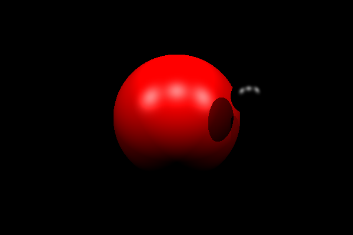
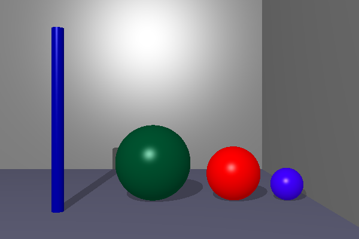
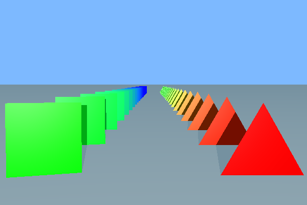
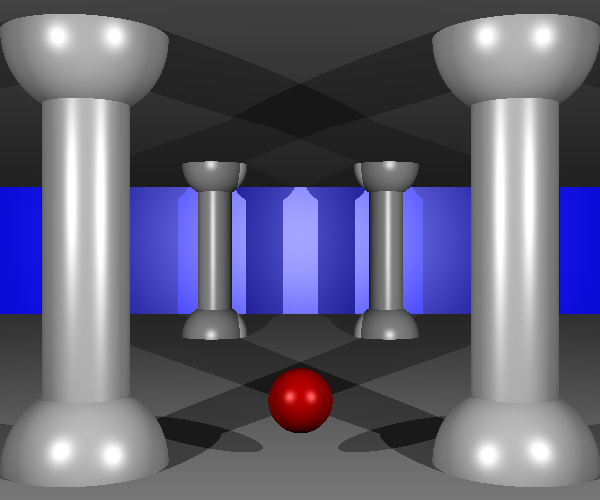

# miniRT
A mini Ray Tracer program written in C.

# Figures
This program can render following figures.

- Spheres
- Triangles
- Squares
- Cylinders
- Planes

# Examples
## Spheres with multi spots

## Cylinder and spheres in a room

## Squares and triangles

## A temple??

